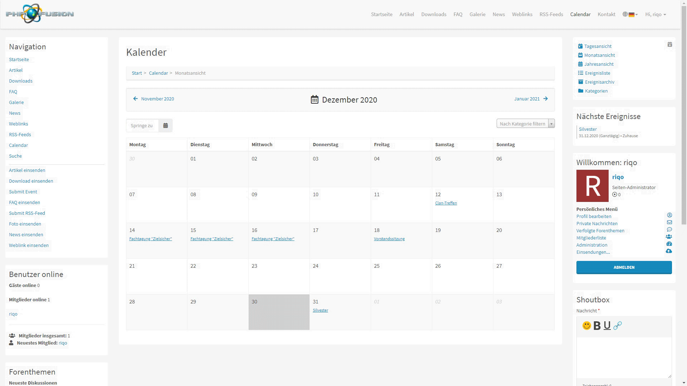

# Kalender
Ein einfaches Kalender-System für PHP-Fusion v9, bei dem Nutzer Events bzw. Ereignisse, nach Kategorien getrennt, einsenden können.

Ereignisse werden grafisch über eine Tages-, Monats- oder Jahresansicht angezeigt. Die Ereignisliste zeigt kommende Ereignisse, das Ereignisarchiv vergangene Ereignisse an. Die Kategorieansicht stellt die vorhandenen Kategorien mit den nächsten drei Ereignissen dar.

### Weitere Features
- Sichtbarkeiten für Rollen bzw. Benutzergruppen
- Differenzierte Einträge je nach Sprache
- Filtern nach Kategorien in sämtlichen Ansichten
- Datum-Schnellwahl in Monats- und Jahresansicht
- Möglichkeit, an Ereignissen teilzunehmen und eine Notiz zu hinterlegen
- Darstellung des Orts via Google Maps Map
- Hinzufügen von einem Anhang oder Link
- Ereignisse über iCal eurem Termin-Kalender (z. B. Outlook) hinzufügen
   - Alle Ereignisse
   - Alle Ereignisse innerhalb einer Kategorie
   - Nur aktuelles Ereignis
etc.

---

# Calendar
A simple calendar system for PHP-Fusion v9, where users can submit events, separated by categories.

Events are graphically displayed in a day, month or year view. The event list shows upcoming events, the event archive shows past events. The category view shows the existing categories with the next three events.

### More features
- Visibilities for roles or user groups
- Differentiated entries depending on the language
- Filter by categories in all views
- Quick date selection in month and year view
- Ability to participate in events and leave a note
- Presentation of the location via Google Maps Map
- Add an attachment or link
- Add events to your appointment calendar (e.g. Outlook) via iCal
    - All events
    - All events within a category
    - Current event only
etc.

# Screenshots
