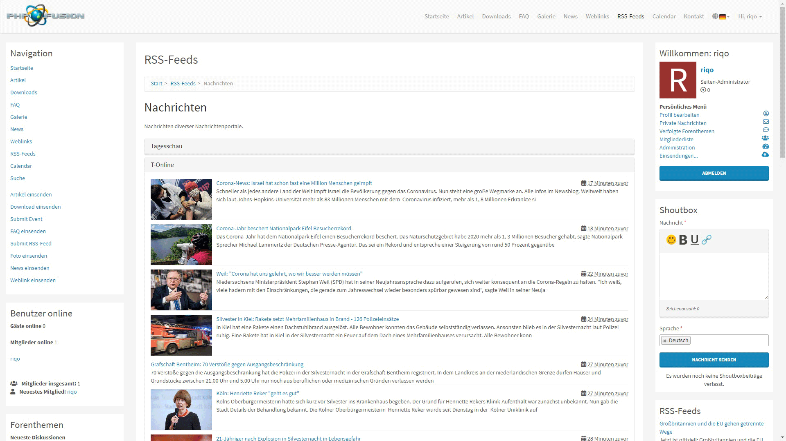

# RSS-Feed-Parser
Ein einfacher RSS-Feed-Parser für PHP-Fusion v9, bei dem Nutzer RSS-Feeds, nach Kategorien getrennt, einsenden können. Feeds werden in die Datenbank zwischengespeichert. Aktualisierungen erfolgen mittels client- oder serverseitigem Cronjob.

RSS-Feeds werden, getrennt nach den jeweiligen Feeds, mit Titel, Beschreibung, Publikationsdatum, und soweit vorhanden, mit Bild und/oder Video in einer Listenansicht dargestellt.

### Weitere Features
- Sichtbarkeiten für Rollen bzw. Benutzergruppen
- Differenzierte Feeds je nach Sprache


### Cronjob
- Einstellung des Aktuailsierungsintervalls für clientseitigen Cronjob
- Aktualisierung via Crontab möglich (empfohlen), bspw. über cURL (clientseitige Akualisierung deaktivieren, force_cron = 1 übergeben)

```
curl www.yourdomain.com/infusions/rss/cron.php?force_cron=1
```

---

# RSS feed parser
A simple RSS feed parser for PHP-Fusion v9, where users can send RSS feeds separated by categories. Feeds are cached in the database. Updates are carried out using a client or server-side cron job.

RSS feeds are shown separately according to the respective feeds, with title, description, publication date and, if available, with image and / or video in a list view.

### More features
- Visibilities for roles or user groups
- Differentiated feeds depending on the language


### Cronjob
- Setting the update interval for client-side cron jobs
- Update via crontab possible (recommended), e.g. via cURL (deactivate client-side update, pass force_cron = 1)

```
curl www.yourdomain.com/infusions/rss/cron.php?force_cron=1
```

# Screenshots
